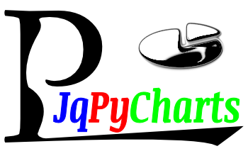

=============
Documentation
=============

This is release |release| of a Python package named :mod:`!JqPyCharts`.

:Author: peter1000
:Github: https://github.com/peter1000

Welcome
=======
`JqPyCharts` is a selection of: Javascripts / Css for simple charts in python projects.

**Credit goes to all the projects which `JqPyCharts` makes use of:**

- `jquery <https://jquery.org/>`_
- `jqPlot <https://bitbucket.org/cleonello/jqplot>`_

Content Summary
===============

.. rst-class:: floater

.. seealso:: :ref:`What's new in JqPyCharts <whats-new>`

Introductory Materials
----------------------

:doc:`install`
   requirements and installations instructions

:doc:`history`
   history of current and past releases

.. _code-usage-examples:

Code & Usage Examples
=====================

:ref:`JqPyCharts Usage Example <jqpycharts-usage-examples>`

For more *examples* see any files in the `JqPyCharts source` (not all projects might have all of these folders).

- :samp:`{SOURCE}/Examples`

- :samp:`{SOURCE}/Tests`

Online Resources
================

.. rst-class:: html-plain-table

   ================ ====================================================
   Homepage:        `<https://github.com/peter1000/JqPyCharts>`_
   Online Docs:     `<http://packages.python.org/JqPyCharts>`_
   Download & PyPI: `<http://pypi.python.org/pypi/JqPyCharts>`_
   Source:          `<https://github.com/peter1000/JqPyCharts>`_
   ================ ====================================================

Projects using JqPyCharts
=========================

Known `projects` which make use of: **JqPyCharts**

- `PyNHEP <https://github.com/peter1000/PyNHEP>`_
   PyNHEP: The N(utrition) and H(ealthy) E(ating) P(lanner).
